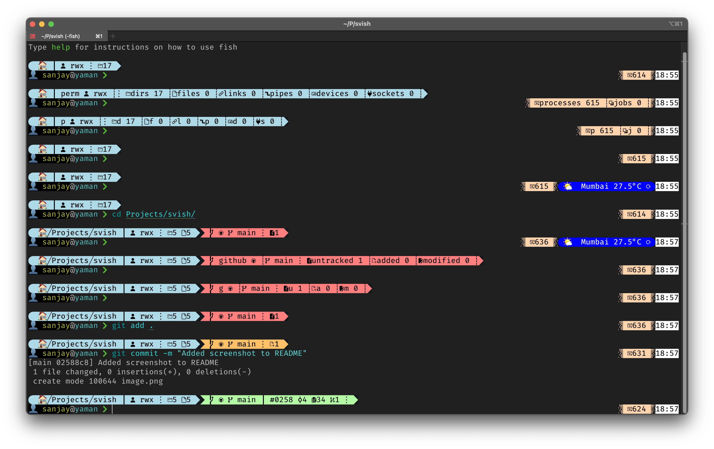
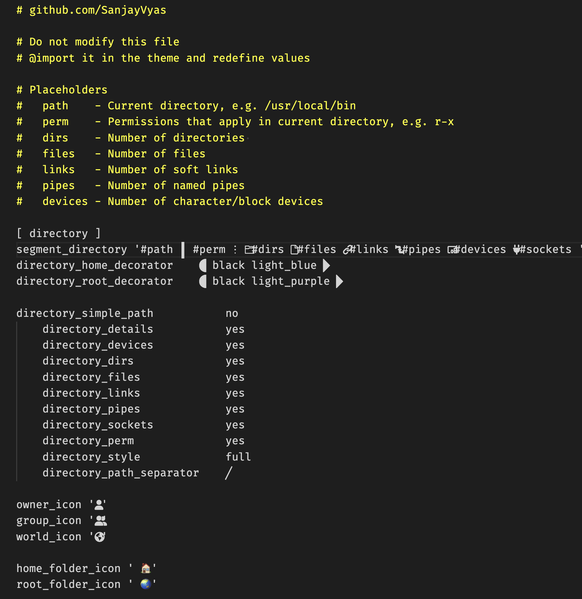
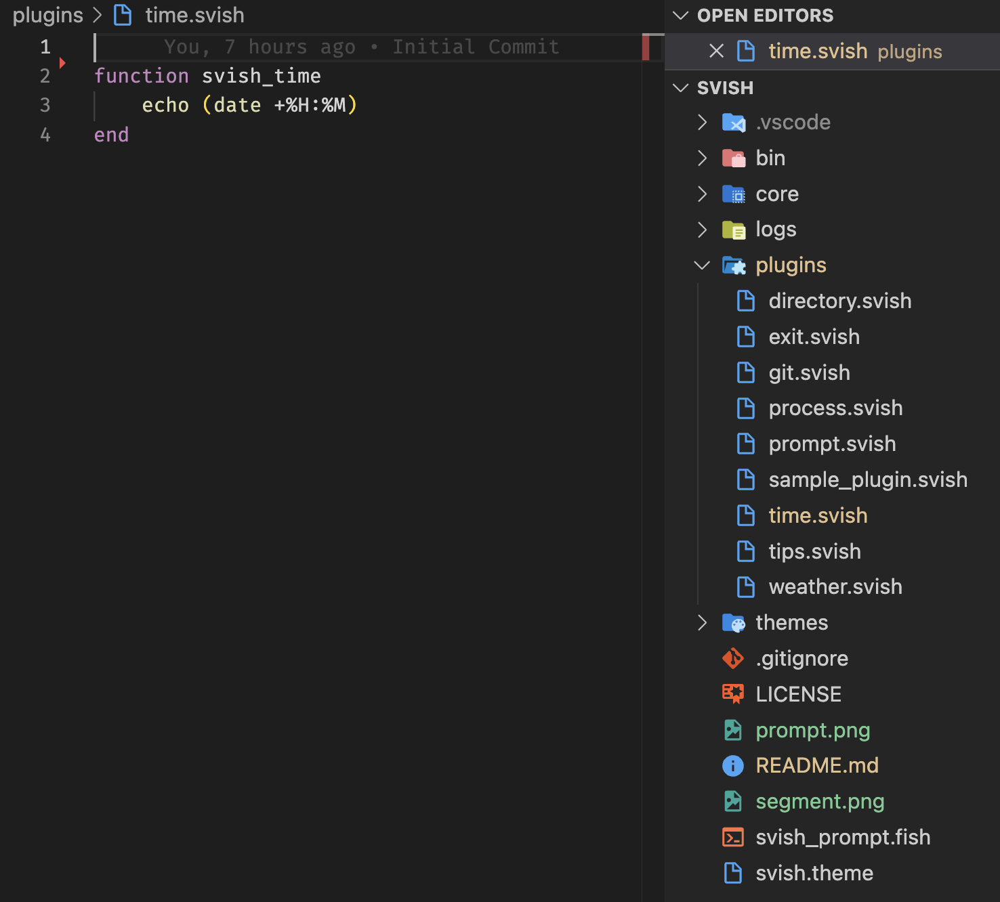

# svish: A Configurable Fish Prompt for Developers

**svish** is a fish shell prompt inspired by other popular prompts, designed to be both powerful and user-friendly.

## Features

* **Highly Configurable:**  svish prioritizes user customization while keeping configuration simple. Explore and modify the provided sample themes in the `theme` folder to personalize your prompt. Don't worry, incorrect configurations won't break the prompt!
* **Plugin Support:** Extend svish's functionality by creating plugins. Plugins are essentially functions that output content, and svish handles the decorations, connectors, and placement.

## Installation

### Prerequisites

* **Fish Shell:** Download and install Fish shell from https://fishshell.com
* **Nerd Font:** Download and install a nerd font from https://www.nerdfonts.com/ for displaying icons within the prompt.
* **Nerd Font Compatible Terminal:**
    * For Mac, iTerm2 is recommended as the built-in terminal has limited nerd font support. Download iTerm2 from https://iterm2.com/.
    * On other operating systems, ensure your terminal emulator supports nerd fonts.
* **jq (optional):** If you plan to use plugins that require JSON parsing, install jq from https://github.com/jqlang/jq.

### Steps

1. **Clone or Download the Repository:**

    * Clone the repository using git:
        ```bash
        git clone http://github.com/SanjayVyas/svish
        ```
    * Alternatively, download the ZIP archive from the repository and extract it.

2. **Copy the Theme:**

    * Copy the sample theme you like from the `themes` folder to the main directory of the project and rename it to `svish.theme`.

3. **Set the Fish Prompt:**

    * Navigate to your fish shell configuration directory:
        ```bash
        cd ~/.config/fish/functions
        ```
    *  **Create a symbolic link to the `svish_prompt.fish` file (copy this command):**
        ```bash
        ln -s /path/to/svish/svish_main.fish fish_prompt.fish
        ```
        Replace `/path/to/svish` with the actual path to your cloned/downloaded svish repository.

## Usage

Once you've set up svish, it should automatically be your default fish shell prompt. The prompt will display various information based on your configuration in the `svish.theme` file.

## Contact

For any questions or feedback, feel free to reach out to the project maintainer.

**Note:** Replace `svish.prompt you_know_what_to_put gmail.com` with the appropriate contact information.

## Screenshots
Some promplets auto-expand to reveal what the icons and counts mean.
Some promplets will appear only when there is new/changed information to show.
Some promplets will appear periodically.



The sweet part is that they are 100% configurable using a template and set of flags


Writing a plugin is as easy as 1-2-3. Create a new file plugin_name.svish, write a single function svish_plugin_name. echo the output you want and drop it in plugins folder. Thats it!

